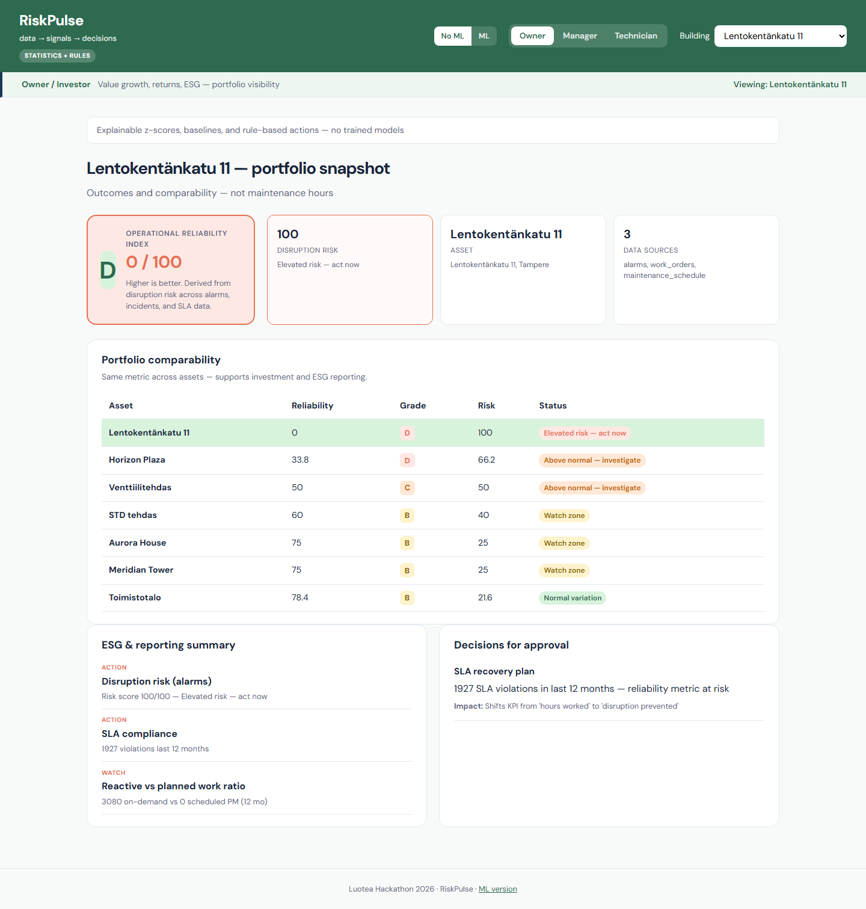
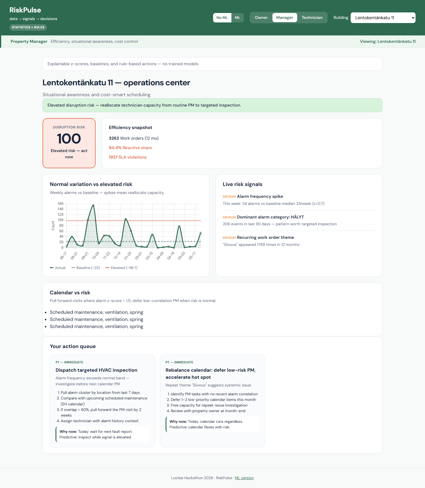
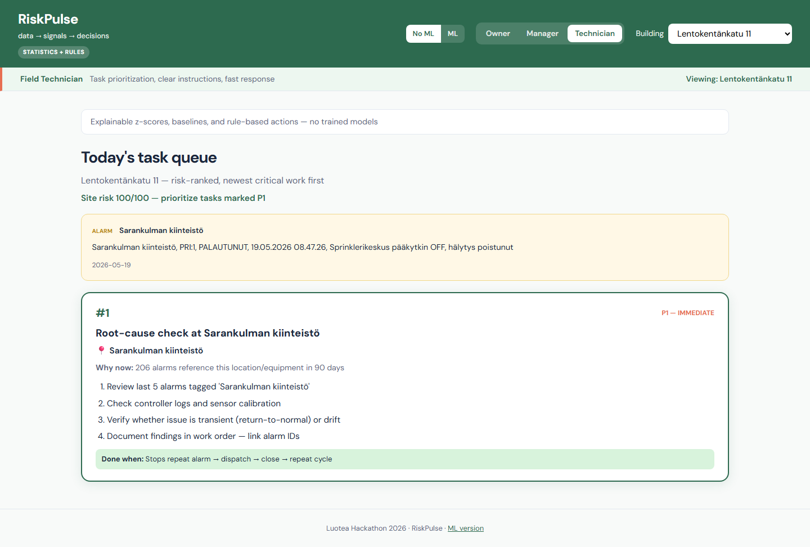

# RiskPulse

**Luotea Hackathon 2026** — from reactive alarms to predictive maintenance decisions.

> Turn real building data (alarms, work orders, Smartti climate, KONE occupancy) into **risk scores** and **role-specific actions** before faults escalate.

---

## The problem

Property maintenance is still largely **reactive**: teams respond after alarms, complaints, or calendar-based inspections. By then, cost, downtime, and tenant impact are already baked in.

## Our answer

**RiskPulse** connects hackathon datasets into a single pipeline:

**Data → Signals → Decisions**

| Stage | What happens |
|-------|----------------|
| **Data** | Alarms, work orders, maintenance plans, Smartti sensors, KONE lifts |
| **Signals** | Baselines, z-scores, anomaly detection, short-horizon forecasts |
| **Decisions** | Prioritised actions for owner, manager, and field technician |

Same underlying analysis — **three different views**, each in language that role actually uses.

---

## Demo at a glance

| | **No-ML mode** | **ML mode** |
|---|----------------|-------------|
| **Route** | `/riskpulse-no-ml` | `/riskpulse-ml` |
| **Engine** | Statistics + rules (explainable) | Isolation Forest + forecast + escalation probability |
| **Best for** | Judges, stakeholders, “how does it work?” | “What if we add ML on top?” |

**7 hackathon properties** — Valmet sites (alarms + maintenance) and NovaProp sites (Smartti + KONE).

---

## Three audiences

Click **Owner · Manager · Technician** in the live demo.

| Role | Cares about | Sees in RiskPulse |
|------|-------------|-------------------|
| **Owner / Investor** | Returns, ESG, portfolio | Reliability index (A–D), cross-asset comparison, approval decisions |
| **Property Manager** | Efficiency, SLA, cost | Risk chart vs baseline, signal feed, action queue |
| **Field Technician** | Where to go, what to do | Ranked task cards, alarm context, step-by-step checklists |

---

## Screenshots

Add captures to [`docs/screenshots/`](docs/screenshots/) and they will render here.

| View | Description |
|------|-------------|
| Owner dashboard | Portfolio reliability + ESG summary |
| Manager dashboard | Risk chart with baseline band + recommended actions |
| Technician view | Prioritised field tasks with instructions |

<!-- Replace paths when screenshots are added:



-->

---

## 10-minute pitch flow

1. **Problem** (1 min) — calendar maintenance; faults only visible after alarms
2. **Live demo** (5 min) — switch buildings, show spike vs baseline, read 2–3 actions per role
3. **Architecture** (2 min) — data → signals → decisions; dual no-ML / ML routes
4. **Next** (2 min) — LLM technician instructions, mobile layout, room-utilization signal

---

## Try it

**Developers:** full setup (local, Docker, ports, API) → **[`riskpulse/README.md`](riskpulse/README.md)**

Fastest path if you have Docker + organizer data:

```bash
git clone https://ishtech.github.com/muneer2ishtech/Luotea-Hackathon-2026.git
cd Luotea-Hackathon-2026/riskpulse
docker compose up --build
# → http://localhost:8090/riskpulse-no-ml
```

| Branch / tag | Purpose |
|--------------|---------|
| [`dev`](https://ishtech.github.com/muneer2ishtech/Luotea-Hackathon-2026/tree/dev) | Ongoing work |
| [`main`](https://ishtech.github.com/muneer2ishtech/Luotea-Hackathon-2026/tree/main) | Tested & integrated |
| [Release Tags](https://github.com/muneer2ishtech/Luotea-Hackathon-2026/tags) | Stable releases (latest [`v0.4.0`](https://ishtech.github.com/muneer2ishtech/Luotea-Hackathon-2026/releases/tag/v0.4.0)) |

---

## Data & repos

| Repo | Role |
|------|------|
| **Organizer data** (`Luotea-Hackathon-2026/`) | Read-only hackathon datasets — **do not commit changes there** |

---

## Team Inventix

Mahmood Akhtar · [Muneer Syed](https://github.com/muneer2ishtech) · Vinay · Saad Mahmood · Afzal

---

<p align="center">
  <strong>Technical documentation → <a href="riskpulse/README.md">riskpulse/README.md</a></strong>
</p>
